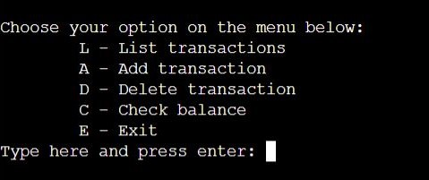
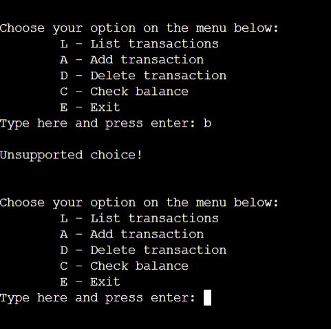
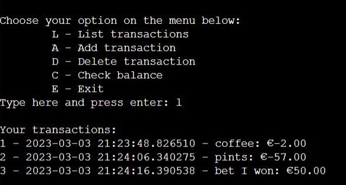
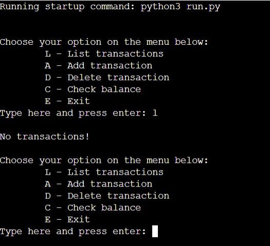
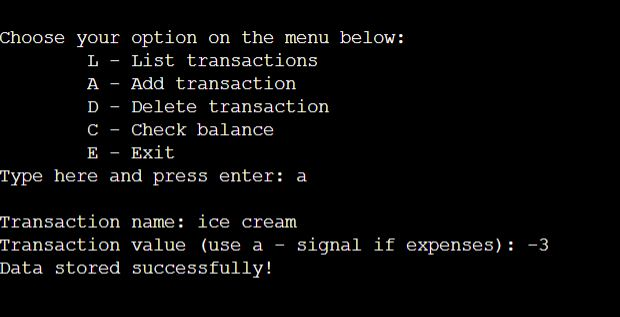
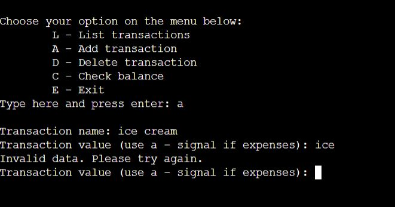
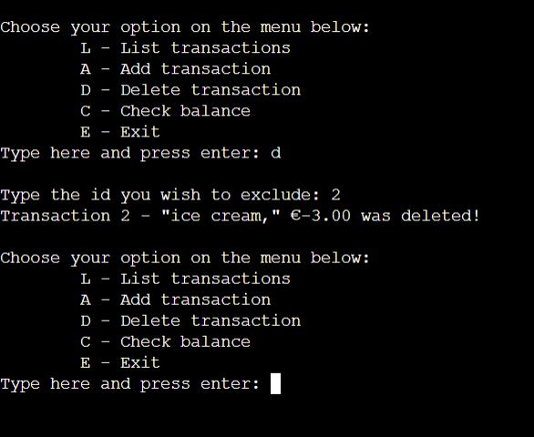
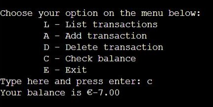
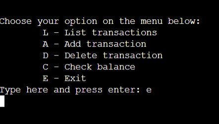
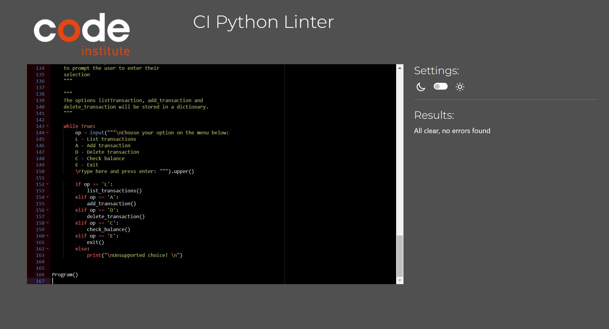

# "Expensive Irish Houses" Finances app

## About
This app was inspired by my own experience of trying to save money to achieve the goal of buying a house. It can be used for anyone who wants to save some money.
With a clean visual the user will be able to see, delete in form of a list all the transactions that were saved. As well as checking the most recent balance.

The live website on Heroku can be accessed at the following link: [Live Website on Heroku](https://expensive-irish-houses.herokuapp.com/)

## Content
* [Introduction](#expensive-irish-houses-finances-app)
* [Features](#features)
    * [Menu](#menu)
        * [List Transactions](#list-transactions)
        * [Add Transaction](#add-transaction)
        * [Delete Transaction](#delete-transaction)
        * [Check Balance](#check-balance)
        * [Exit](#exit)
    * [Features Left to Implement](#features-left-to-implement)
* [User Experience](#user-experience)
    * [User stories](#user-stories)
        * [User goals](#user-goals)
    * [Design](#design)
    * [Acessibility](#acessibility)
    * [Process Flow](process-flow)
* [Technologies and Languages Used](#technologies-and-languages-used)   
* [Testing](#testing)
* [Bugs](#bugs)    
* [Deployment](#deployment)
* [Credits](#credits)
* [Acknowledgements](#acknowledgements)

## Features
## Menu
* The inicial input request the user to select an option.
* Despite of the menu options beein in capital letter, the user can input also in lowercase without getting an error message.

* If a non-correspondent letter is pressed, a validation message appears informing the user and they get to choose it again from the options on the menu.

### **List Transactions**
* This feature print the transactions on the screen for the user.

* If the transactions list is empty, the user will get a validation message informing about it.

### **Add Transaction**
* If the user choose to add a transaction it will be requested to insert a description and an amount. In case on an expense the user has to use the minus sign.

* In this section, if the user insert characters instead of number for the amount, it will get a validation message and will be requested to insert the amount again.

### **Delete Transaction**
* If the user wish to delete a transaction from the list the delete selection will do that. 
* What the user needs to do is choose the ID for the transaction. 
* After deleting the transaction the user will get a message with the information about what was deleted.
* Once a transaction is deleted, the transactions list will be updated.

### **Check Balance**
* The check balance input shows on the screen the user's balance.

### **Exit**
* The exit input, exit the application.

## Features Left to Implement
* Provide the user the possibility of keeping a Google spreadsheet with all the transactions saved in the app so it can be used for external purposes.
* For *List Transactions*, there will be a new functionality of listing the transactions per month.
* For *Add Transaction* there will be the possibility of adding more than one transaction without returning to the menu, to make it more practical for the user.
* Another feature for the menu will be added to make it possible for the user to edit the transactions.

## User Experience
The design of the game was all thinking about make things simple for the user. With simple features and clear context to help them navigate through the app.

### User stories
#### User goals
* The main goal is to provide to the users a money management solution in their every day lives.
* It is easy to navigate, making it intuitive for the users, even the ones that are not tech experts.
* It provides error messages if inserting the wrong data, e.g.: inserting words where should be numbers, typing the wrong selection letter or trying to access a list with no date in it.

### Design
* The design of the finance app is simple and straightforward. In the future the possibility of creating graphs based on the date that has been input will be added to make it more visual for the user. The instructions providade to the user make it easy to navigate and the errors messages helps it when needed.
* For the code, it was used loop to iterate throughout the menu features.

### Acessibility
The app provides error messages and instruct the user to correct if inserting the wrong data, e.g.: inserting words where should be numbers, typing the wrong selection letter or trying to access a list with no date in it.

### Process Flow
Below is flow chart that demonstrates what actions take place while the user is in the app.

## Technologies and Languages Used
* [Github](https://github.com/) and [Gitpod](https://www.gitpod.io/) to create the Python code.
* [Heroku](https://www.heroku.com/) for deployment.
* Language: [Python](https://www.python.org/).

## Testing
The code was tested using the [CI Python Linter](https://pep8ci.herokuapp.com/). All my code was up to PEP8 standards, except for a few erros with blank spaces and some lines to long. As an advise from my mentor I used *# noqa E501* to fix the long lines. The whole code was fixed so is all clear, no erros found.

## Bugs
### Fixed bugs
* **ID in the json.file wasn't updating:** used str(leng)+1 and enumerate to organize the dictionary list.
* **Delete transaction:** the dictionary was beeing subscribed after deleting a transaction, to fix I created a new function called update_transaction and applied for all the functions and the json.file. This way the jason.file was beeing updated and reorganized after a deletion.
* Other bugs were mostly quotation marks forgoten, colon or semicolon in the wrong place or indentation problem.

## Deployment
The project was deployed on Heroku using the following method:
1. Commit and push the project.
2. Create a Heroku account.
3. From the Heroku dashboard  we’ll click “Create new app” button.
4. Choose a name to the app.
5. Select your region. 
6. Click *Create app*. 
7. Add a couple of buildpacks to the application. Such as Python and node.js. Click *Save*.
8. Go to the deploy section and choose the deployment method. Select Github, and then confirm that we want to connect to Github. Search for our Github repository name,and then  click *Search* and *connect*  
9. Choose to  manually deploy using this deploy branch option.  
10. Finally we see the *App was successfully deployed* message, the button on the bottom take you to the deployed link.

## Credits
* For inspiration I used two videos that can be found [here](https://www.youtube.com/watch?v=IbdgcUqWSeo&t=194s) and [here](https://www.youtube.com/watch?v=A3PRB1Wc0UA).

## Acknowledgements
* Thank you to my new mentor Rory Sheridan for the amazing support and tips.
* Thank you to my parter and friends that helped me in the hard moments troughout the project.

