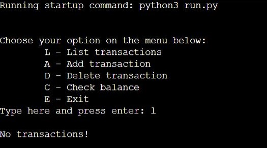
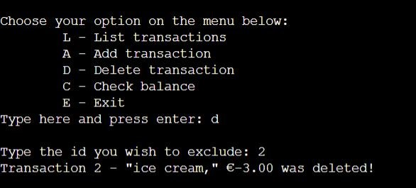

# "Expensive Irish Houses" Finance app

## About
This app was inspired by my own experience of trying to save money to achieve the goal of buying a house. It can be used for anyone who wants to save money.
With a clean visual the user will be able to track their finances with clear visuals. They can add, delete transactions and check their balance.

The live website on Heroku can be accessed through following [link.](https://expensive-irish-houses.herokuapp.com/)

## Content
* [Introduction](#expensive-irish-houses-finances-app)
* [Features](#features)
    * [Menu](#menu)
        * [List Transactions](#list-transactions)
        * [Add Transaction](#add-transaction)
        * [Delete Transaction](#delete-transaction)
        * [Check Balance](#check-balance)
        * [Exit](#exit)
    * [Features Left to Implement](#features-left-to-implement)
* [User Experience](#user-experience)
    * [User stories](#user-stories)
        * [User goals](#user-goals)
    * [Design](#design)
* [Technologies and Languages Used](#technologies-and-languages-used)   
* [Testing](#testing)
* [Bugs](#bugs)    
* [Deployment](#deployment)
* [Credits](#credits)
* [Acknowledgements](#acknowledgements)

## Features
## Menu
* The initial input requests the user to select an option on the menu.
* The app responds to users inputting either capital or lower case letters.

* If a non-correspondent letter is input, a validation message appears informing the user to choose again from the options on the menu.

### **List Transactions**
* This feature prints the transactions on the screen for the user.

* If the transactions list is empty, the user will get a validation message.

### **Add Transaction**
* If the user chooses to add a transaction. The app will request the user to insert a description and an amount. In case of an expense the user has to use the minus sign.

* In this section, if the user insert characters instead of number for the amount, they will get a validation message and will be requested to insert the amount again.

### **Delete Transaction**
* If the user wishes to delete a transaction from the list they can use the delete functionality. 
* The app requests from the user the ID to be deleted. 
* After deleting the transaction the user will get a confirmation message.
* Once a transaction is deleted, the transactions list will be updated.

### **Check Balance**
* The check balance input shows on the screen the user's balance.

### **Exit**
* The exit input, exit the application.

## Features Left to Implement
* Provide the user the possibility of keeping a Google spreadsheet with all the transactions saved in the app so it can be used for external purposes.
* For *List Transactions*, there will be a new functionality of listing the transactions per month.
* For *Add Transaction* there will be the possibility of adding more than one transaction without returning to the menu, to make it more practical for the user.
* Another feature for the menu will be added to make it possible for the user to edit the transactions.

## User Experience
The design of the app was intended to be streamlined and accessible. Features were kept clear and simple help them navigate through the app.

### User stories
#### User goals
* The main goal is to provide to the users a money management solution in their every day lives.
* It is easy to navigate, making it intuitive for the users, even the ones that are not tech experts.
* It provides error messages if inserting the wrong data, e.g. inserting words where should be numbers, typing the wrong selection letter or trying to access a list with no data in it.

### Design
* The design of the finance app is simple and straightforward. In the future the possibility of creating graphs based on the date that has been input will be added to make it more visual for the user. The instructions provided to the user make it easy to navigate and the errors messages help when needed.
* For the code, loops were used to iterate throughout the menu features.
* The flowchart was done manually.

## Technologies and Languages Used
* [Github](https://github.com/) and [Gitpod](https://www.gitpod.io/) to create the Python code.
* [Heroku](https://www.heroku.com/) for deployment.
* Language: [Python](https://www.python.org/).

## Testing
The code was tested using the [CI Python Linter](https://pep8ci.herokuapp.com/). All code was kept to PEP8 standards, apart from some small errors e.g. blank spaces and line length. To correct this I used *# noqa E501*. The whole code was fixed.

## Bugs
### Fixed bugs
* **ID in the json.file wasn't updating:** used str(leng)+1 and enumerate to organize the dictionary list.
* **Delete transaction:** the dictionary was being subscribed after deleting a transaction, to fix I created a new function called update_transaction and applied for all the functions and the json.file. This way the jason.file was being updated and reorganized after a deletion.
* Other bugs were mostly quotation marks forgotten, colon or semicolon in the wrong place or indentation problem.

## Deployment
The project was deployed on Heroku using the following method:
1. Commit and push the project.
2. Create a Heroku account.
3. From the Heroku dashboard click “Create new app” button.
4. Choose a name for the app.
5. Select your region. 
6. Click *Create app*. 
7. Add a couple of buildpacks to the application. Such as Python and node.js. Click *Save*.
8. Go to the deploy section and choose the deployment method. Select Github, and then confirm that we want to connect to Github. Search for our Github repository name, and then  click *Search* and *connect*  
9. Choose to  manually deploy using this deploy branch option.  
10. Finally we see the *App was successfully deployed* message, the button on the bottom takes you to the deployed link.

## Credits
* For inspiration I used two videos that can be found [here](https://www.youtube.com/watch?v=IbdgcUqWSeo&t=194s) and [here](https://www.youtube.com/watch?v=A3PRB1Wc0UA).

## Acknowledgements
* Thank you to my new mentor Rory Sheridan for the amazing support and tips.
* Thank you to my partner and friends that helped me in the hard moments throughout the project.

